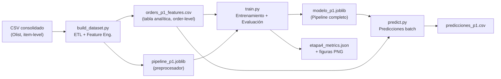
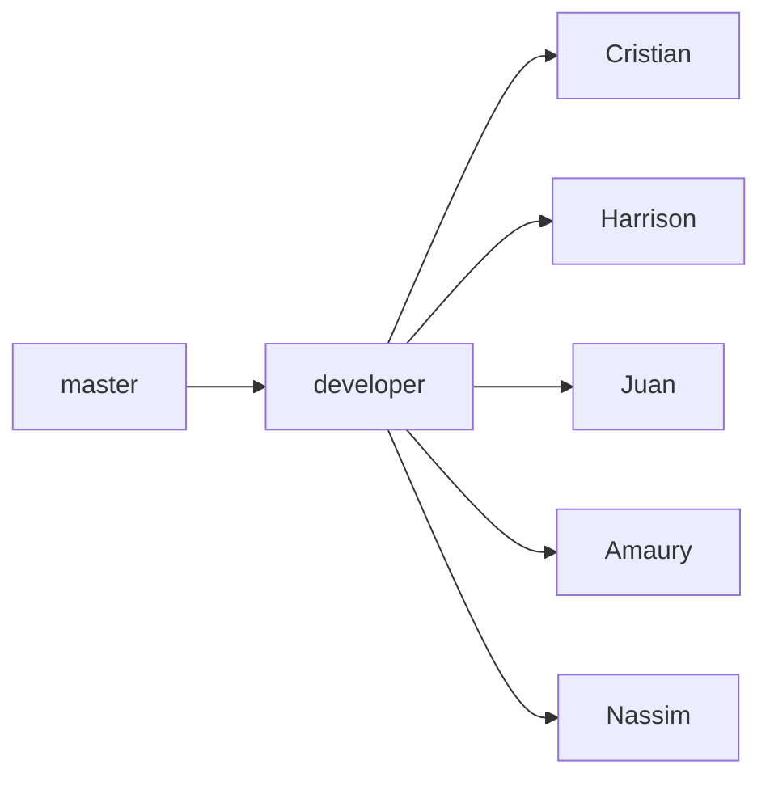

# Contexto y Reglas del Proyecto — Vertex Insights Olist

> Documento generado automáticamente por levantamiento de código.  
> **Última actualización:** 2026-06-26  
> **Rama de trabajo:** `Harrison` (sincronizada con `developer` al nivel de V1.3.0)

---

## 0. Nota para el Asistente IA — Nivel del Usuario

> [!IMPORTANT]
> **El usuario de esta sesión tiene un nivel técnico básico.** Cuando generes respuestas, explicaciones o sugerencias:
>
> - **Explica conceptos técnicos** la primera vez que aparezcan (ej: qué es un Pipeline, qué es un split temporal, qué es PR-AUC, etc.)
> - **No asumas conocimiento previo** de scikit-learn, Git avanzado, Docker, APIs, o arquitectura de ML.
> - **Usa analogías simples** cuando sea posible para explicar decisiones de diseño.
> - **Muestra los comandos completos** con explicación de cada flag/argumento.
> - **Si una tarea tiene riesgo** (ej: push a remoto, eliminar una rama), explica qué va a pasar antes de ejecutar.
>
> Esta directiva aplica a **todas las conversaciones futuras** que usen este documento como contexto.

---

## 1. Identidad del Proyecto

| Campo | Valor |
|---|---|
| **Nombre** | Vertex Insights — Olist Recommender |
| **Repositorio** | [cfgarciac/vertex-insights-olist-recommender](https://github.com/cfgarciac/vertex-insights-olist-recommender) |
| **Contexto académico** | Proyecto Final — Carrera Data Science de [Soy Henry](https://www.soyhenry.com/) |
| **Equipo** | Vertex Insights (5 integrantes) |
| **Metodología** | Scrum (sprints, backlog, ceremonias, GitHub Projects) |
| **Framework de DS** | CRISP-DM (etapas 1–9) |

### Equipo y roles

| Integrante | Rol | Rama personal |
|---|---|---|
| Tutalcha Pame, Harrison Alberto | Product Owner | `Harrison` ← **tu rama** |
| García Cadena, Cristian Fernando | Scrum Master | `Cristian` |
| Wessin, Nassim | Machine Learning Engineer | `Nassim` |
| Aguilar Lomas, Oscar Amaury | Data Scientist | `Amaury` |
| López Solórzano, Juan Carlos | Data Analyst | `Juan` |

> [!IMPORTANT]
> **Pivote P1:** Aunque el nombre del repositorio dice "Recommender", el equipo pivoteó (decisión D-16) hacia un **clasificador de entrega tardía** (`entrega_tarde`). Todo el código implementado corresponde a este enfoque (P1). El recomendador se difirió o abandonó.

---

## 2. Setup Local (Guía paso a paso)

Esta sección explica cómo preparar tu computadora para trabajar con el proyecto **desde cero** después de clonar el repositorio.

### 2.1 Prerrequisitos

- **Python 3.10+** instalado (actualmente usas Python 3.12.10)
- **Git** instalado y configurado con tu cuenta de GitHub
- **gh CLI** (opcional, solo si necesitas crear issues desde terminal)

### 2.2 Pasos de setup

```powershell
# 1. Clonar el repositorio (si no lo has hecho)
git clone https://github.com/cfgarciac/vertex-insights-olist-recommender.git
cd vertex-insights-olist-recommender

# 2. Cambiarte a tu rama personal
git checkout Harrison

# 3. Sincronizar con developer (para tener los últimos cambios del equipo)
git fetch origin
git merge origin/developer

# 4. Crear el entorno virtual
#    (Un "entorno virtual" es una copia aislada de Python donde instalas
#     las librerías del proyecto sin afectar tu Python global.)
python -m venv venv

# 5. Activar el entorno virtual
#    (Esto le dice a tu terminal "usa el Python de este proyecto".)
.\venv\Scripts\activate

# 6. Instalar todas las dependencias del proyecto
#    (Esto descarga e instala todas las librerías que usa el código.)
pip install -r requirements-dev.txt

# 7. Verificar que funciona
python -c "import pandas; import sklearn; import xgboost; print('✅ Todo instalado correctamente')"
```

### 2.3 Dataset (datos de Olist)

Los archivos CSV del dataset **NO están en el repositorio** (son muy pesados y están en el `.gitignore`). Debes tenerlos localmente:

| Dato | Valor |
|---|---|
| **Ubicación local de los CSV** | `C:\Users\LENOVO\Documents\Cursos\Soy Henry\PF\proyecto\MLops_Pipeline_VERTEX\OLIST DATASETS` |
| **CSV consolidado requerido** | `orders_consolidated.csv` (112,650 filas, una fila por ítem de pedido) |
| **Fuente original** | [Brazilian E-commerce Dataset by Olist en Kaggle](https://www.kaggle.com/datasets/olistbr/brazilian-ecommerce) |

> [!WARNING]
> Si necesitas ejecutar el pipeline de datos (`build_dataset.py`), debes pasarle la ruta al CSV con `--input`:
> ```powershell
> python -m src.features.build_dataset --input "C:\Users\LENOVO\...\orders_consolidated.csv"
> ```

### 2.4 Qué ya está creado y no necesitas hacer

- ✅ `.gitignore` — Ya existe y cubre: `venv/`, `data/raw/`, `data/processed/`, `*.csv`, `*.parquet`, `artifacts/*.pkl`, `.env`, `__pycache__/`, etc.
- ✅ Estructura de carpetas — Ya creada por el equipo.
- ✅ Ramas — Ya existen las 7 ramas del flujo (master, developer, y las 5 personales).

---

## 3. Stack Tecnológico

### Stack activo (código existente)

| Capa | Tecnología | Versión | Qué hace |
|---|---|---|---|
| Lenguaje | **Python** | 3.12.10 (tu máquina) | Todo el proyecto está escrito en Python |
| Datos | **pandas** | ≥2.0 | Tablas de datos (como Excel pero en código) |
| Numérico | **numpy** | ≥1.24 | Cálculos matemáticos rápidos |
| ML | **scikit-learn** | ≥1.3 | Herramientas de Machine Learning (preprocesamiento, métricas, modelos) |
| ML (boosting) | **XGBoost** | 3.2.0 | Modelo de ML avanzado (el elegido para P1) |
| Serialización | **joblib** | ≥1.3 | Guardar/cargar modelos entrenados como archivos |
| Visualización | **matplotlib** | 3.10.9 | Gráficos estáticos |
| Visualización | **seaborn** | 0.13.2 | Gráficos estadísticos bonitos (sobre matplotlib) |
| Estadística | **scipy** | ≥1.10 | Funciones matemáticas y estadísticas |
| Notebooks | **Jupyter** | 1.1.1 | Cuadernos interactivos para explorar datos |
| Calidad | **black** / **flake8** | ≥23.7 / ≥6.1 | Formateo y revisión de estilo del código |
| Testing | **pytest** | ≥7.4 | Pruebas automáticas del código |

### Stack planificado (Etapas 6–7, sin código aún)

| Tecnología | Para qué se usará |
|---|---|
| **FastAPI** | Crear una API (un servicio web que recibe pedidos y devuelve predicciones) |
| **Streamlit** | Crear un dashboard interactivo (página web con gráficos) |
| **Docker** | Empaquetar la aplicación para que funcione en cualquier computadora |

> [!NOTE]
> **No hay `pyproject.toml` ni `setup.py`.** Las dependencias se manejan solo con archivos `requirements.txt`. El archivo `requirements-dev.txt` hereda todo de `requirements.txt` y agrega herramientas extras para desarrollo.

---

## 4. Arquitectura del Proyecto

### Tipo de sistema

**Pipeline de ML para clasificación binaria** (P1: predicción de entrega tardía).

> **¿Qué significa "clasificación binaria"?** El modelo responde una pregunta de sí/no: "¿este pedido llegará tarde?" (1 = sí, 0 = no).

NO es (actualmente):
- ❌ Una API REST
- ❌ Un sistema de recomendación
- ❌ Una aplicación web
- ❌ Un pipeline en la nube

### Flujo del pipeline



> **¿Qué es cada pieza?**
> - **ETL** = Extraer, Transformar y Cargar datos. Limpia el CSV crudo y lo convierte en algo útil.
> - **Feature Engineering** = Crear variables nuevas a partir de los datos originales (ej: calcular la distancia entre cliente y vendedor).
> - **Pipeline** = Una secuencia de pasos encadenados (limpiar → transformar → predecir) que se ejecutan automáticamente.
> - **`.joblib`** = Un archivo que guarda un modelo entrenado para reutilizarlo después sin volver a entrenarlo.

### Estructura de carpetas

```
vertex-insights-olist-recommender/
├── .github/
│   ├── ISSUE_TEMPLATE/              # Plantilla para crear issues en GitHub
│   └── workflows/                   # CI/CD (aún vacío)
├── artifacts/                       # Modelos guardados (.joblib, no versionados)
├── data/
│   ├── raw/                         # Datos crudos de Kaggle (NO en git)
│   └── processed/                   # Datos transformados (NO en git)
├── docs/                            # Documentación del proyecto
│   ├── convenciones.md              # Reglas del equipo
│   ├── bitacora_decisiones.md       # Registro de decisiones (D-01 a D-29+)
│   ├── decisiones_fe.md             # Decisiones de feature engineering
│   ├── product_backlog.md           # Lista de tareas (historias de usuario)
│   ├── registro_riesgos.md          # Riesgos identificados (R-01 a R-14+)
│   └── etapas/                      # Cierres formales de cada etapa
├── notebooks/                       # Cuadernos Jupyter (EDA, modelado)
├── reports/                         # Informes, métricas y figuras
├── scripts/                         # Scripts de operaciones del repo
├── src/                             # Código fuente del proyecto
│   ├── features/
│   │   └── build_dataset.py         # ETL + feature engineering
│   └── models/
│       ├── baseline.py              # Modelos triviales (piso de comparación)
│       ├── evaluate.py              # Métricas y análisis de errores
│       ├── predict.py               # Generar predicciones
│       └── train.py                 # Entrenar y seleccionar modelos
├── tests/                           # Pruebas automáticas
├── .gitignore                       # Archivos que Git debe ignorar
├── Dockerfile                       # Placeholder para Docker (Etapa 7)
├── requirements.txt                 # Librerías de producción
└── requirements-dev.txt             # Librerías de desarrollo
```

### Propiedad por subcarpetas

| Subcarpeta | Quién es el responsable principal |
|---|---|
| `notebooks/` | Data Analyst y Data Scientist |
| `src/` | ML Engineer (despliegue), Data Scientist (modelado) |
| `tests/` | Quien escribe el código asociado |
| `docs/` | Scrum Master y Product Owner |
| `reports/` | Data Analyst |
| `artifacts/` | Data Scientist y ML Engineer |
| `.github/` | Scrum Master |
| `scripts/` | Scrum Master |

---

## 5. Reglas de Git y Colaboración

### 5.1 Estructura de ramas



- **`master`**: La versión "oficial" del proyecto. Solo recibe cambios desde `developer` al cierre de cada etapa.
- **`developer`**: Rama de integración. Donde se prueban los cambios antes de pasar a `master`.
- **`Harrison`** (tu rama): Tu rama personal de trabajo. Desde aquí abres PRs hacia `developer`.

> **¿Qué es un PR (Pull Request)?** Es una solicitud para que el equipo revise tu código antes de integrarlo. Funciona así: trabajas en tu rama → abres un PR en GitHub → un compañero lo revisa → si está bien, se aprueba y se integra a `developer`.

### 5.2 Flujo de trabajo diario

```powershell
# INICIO DEL DÍA: traer los últimos cambios del equipo
git checkout Harrison
git fetch origin
git merge origin/developer
# (Si hay conflictos, resolverlos y hacer commit)

# DURANTE EL DÍA: trabajar normalmente, hacer commits
git add .
git commit -m "feat: descripción del cambio"

# FIN DEL DÍA: subir tu trabajo
git push origin Harrison
# Si hay trabajo terminado → abrir PR en GitHub hacia developer
```

### 5.3 Convenciones de commits

**Formato: Conventional Commits** (un estándar que hace que los commits sean descriptivos y organizados)

```
<tipo>(<scope-opcional>): <descripción>
```

| Tipo | Cuándo usarlo | Ejemplo |
|---|---|---|
| `feat` | Nueva funcionalidad | `feat: implementar endpoint de predicciones` |
| `fix` | Corrección de error | `fix: corregir manejo de nulos en pipeline` |
| `docs` | Solo documentación | `docs: agregar sección de instalación` |
| `style` | Formato (sin cambios funcionales) | `style: aplicar black al módulo train` |
| `refactor` | Reorganizar sin cambiar comportamiento | `refactor: extraer función de carga de datos` |
| `test` | Agregar/modificar pruebas | `test: agregar test de serialización` |
| `chore` | Mantenimiento, configuración | `chore: actualizar dependencias` |

**Reglas:**
- Descripción en **español**, en **presente**, sin punto final
- Máximo **72 caracteres** en la primera línea
- Referenciar issue en el cuerpo: `Refs: #N`

### 5.4 Pull Requests

**Título:** `[HU-NN] Descripción corta del cambio`

> `HU-NN` = Historia de Usuario número NN. Es el identificador de la tarea asociada.

**Para que un PR sea aprobado necesita:**
- Título con `[HU-NN]` y descripción clara
- Aprobación de al menos **1 compañero** distinto al autor
- Sin conflictos con `developer`
- Issue asociado referenciado (`Closes #N` o `Refs #N`)

### 5.5 Versionado (tags)

```
V<sprint>.<etapa>.<patch>
```

| Tag | Etapa | Estado |
|---|---|---|
| V1.0.0 – V1.0.3 | Etapa 1 (setup) | ✅ |
| V1.1.0 | Etapa 2 (EDA) | ✅ |
| V1.2.0 | Etapa 3 (Feature Engineering) | ✅ |
| V1.3.0 | Etapa 4 (Modelado) | ✅ ← **actual** |
| V1.4.0 | Etapa 5 (Sprint 1 close) | ⏳ **próximo** |

---

## 6. Reglas de Código

### 6.1 Nomenclatura

| Elemento | Convención | Ejemplo |
|---|---|---|
| Archivos Python | `snake_case.py` | `build_dataset.py` |
| Funciones | `snake_case` | `def add_seller_rate()` |
| Clases | `PascalCase` | `class BaselineClaseMayoritaria` |
| Variables | `snake_case` | `global_rate_train` |
| Constantes | `UPPER_SNAKE_CASE` | `MIN_ORDENES_VENDEDOR = 5` |
| Notebooks | `NN_descripcion.ipynb` | `04_modelado_VERTEX.ipynb` |

> **¿Qué es `snake_case`?** Palabras en minúsculas separadas por guiones bajos: `mi_variable`, `calcular_distancia`.  
> **¿Qué es `PascalCase`?** Cada palabra empieza con mayúscula, sin separadores: `MiClase`, `ModeloEntrega`.  
> **¿Qué es `UPPER_SNAKE_CASE`?** Todo en mayúsculas con guiones bajos: `MAX_ITEMS`, `RANDOM_STATE`.

### 6.2 Patrones de código que sigue el equipo

1. **Docstrings en español** al inicio de cada módulo y función pública.

2. **Type hints** en las firmas de funciones:
   ```python
   from __future__ import annotations
   def mi_funcion(datos: pd.DataFrame, umbral: float) -> dict:
   ```

3. **Secciones numeradas** en cada módulo:
   ```python
   # --------------------------------------------------------------------------- #
   # 1. Carga y limpieza inicial
   # --------------------------------------------------------------------------- #
   ```

4. **`Pipeline` + `ColumnTransformer`** de scikit-learn para preprocesamiento.

5. **CLI con `argparse`** para scripts ejecutables:
   ```python
   def run(...): ...
   def parse_args(): ...
   if __name__ == "__main__":
       args = parse_args()
       run(...)
   ```

6. **Ejecución como módulo**: `python -m src.features.build_dataset` (forma preferida).

7. **Serialización joblib** como diccionario (guarda el modelo + metadatos juntos):
   ```python
   joblib.dump({
       "modelo": pipeline,
       "umbral_f1": float,
       "numeric_features": list,
       ...
   }, path)
   ```

8. **Rutas relativas al proyecto** usando `Path(__file__).resolve().parents[N]`.

9. **Constantes centralizadas** en `build_dataset.py` (`NUMERIC_FEATURES`, `CATEGORICAL_FEATURES`, `COLS_POST`) e importadas por los demás módulos.

---

## 7. Disciplina Anti-Leakage (Regla Crítica)

> [!CAUTION]
> **¿Qué es "leakage" (fuga de datos)?** Es cuando tu modelo "hace trampa" sin que te des cuenta: usa información del futuro para predecir el pasado. Es como estudiar con las respuestas del examen. El modelo parece genial en la práctica, pero en la vida real falla porque esa información no estará disponible.
>
> Esta disciplina es el pilar más importante de la calidad del modelo. Cualquier cambio en features, preprocesamiento o evaluación **DEBE** respetar estas reglas.

### Reglas fundamentales

| Regla | Qué significa | Cómo se implementa |
|---|---|---|
| **Solo features [t0]** | Solo usar datos que se conocen **en el momento de la compra**. NO usar datos que se conocen después (ej: fecha de entrega real, reseñas). | Lista `COLS_POST` en `build_dataset.py` |
| **Candado anti-fuga** | Verificación automática de que ninguna columna prohibida entró al modelo. | `evaluate.assert_sin_features_post()` |
| **Split temporal** | Dividir datos por **fecha** (pasado=train, futuro=test), NO al azar. | `temporal_split()`, proporción 70/15/15 |
| **Tasa del vendedor point-in-time** | Para cada pedido, la tasa de tardanza del vendedor solo usa sus pedidos **anteriores**. | `add_seller_rate()` con desplazamiento |
| **Preprocesador solo en train** | Las transformaciones estadísticas (escalar, imputar) se calculan **solo con datos de entrenamiento**. | `build_preprocessor().fit(train[...])` |

### Columnas prohibidas como features

Son las que contienen información que **solo se conoce después de la entrega**:

```python
COLS_POST = [
    "order_delivered_carrier_date", "order_delivered_customer_date",
    "delivery_days", "delivery_delay_days", "is_late_delivery",
    "review_count", "avg_review_score", "min_review_score",
    "max_review_score", "has_review_comment", "review_comment_titles",
    "review_comment_messages", "last_review_creation_date",
    "last_review_answer_timestamp", "is_dissatisfied",
]
# También prohibidos: "entrega_tarde" (el target) y "dias_vs_promesa"
```

### Señales de alerta

- ROC-AUC o PR-AUC > 0.99 → **probablemente hay fuga** → revisar antes de confiar
- `tasa_vendedor` con peso > 20% en importancias → **revisar el cálculo**

---

## 8. Modelo Actual (V1.3.0)

| Campo | Valor |
|---|---|
| **Target** | `entrega_tarde` (1 = el pedido llegó después de la fecha prometida) |
| **Modelo elegido** | XGBoost (un modelo de ML basado en "árboles de decisión" encadenados) |
| **Métrica principal** | PR-AUC = 0.124 (mide qué tan bien identifica las entregas tardías) |
| **ROC-AUC** | 0.703 (mide qué tan bien distingue entre "a tiempo" y "tarde") |
| **Artefacto** | `artifacts/modelo_p1.joblib` |
| **Métricas** | `reports/etapa4_metrics.json` |

> **¿Qué es ROC-AUC?** Un número entre 0 y 1 que indica qué tan bien el modelo distingue entre las dos clases (tarde vs a tiempo). 0.5 = adivinar al azar. 1.0 = perfecto. 0.703 es razonable para un primer modelo.

### Features del modelo (16 variables que usa para predecir)

**Numéricas (11):** días prometidos, distancia cliente↔vendedor, ratio flete/precio, precio total, flete total, nº de ítems, peso total, volumen total, tasa del vendedor, mes de compra, día de la semana.

**Categóricas (5):** estado del cliente, estado del vendedor, categoría del producto, si están en el mismo estado, si el vendedor tiene historial.

---

## 9. Testing

### Ejecutar tests

```powershell
# Activar el entorno virtual primero
.\venv\Scripts\activate

# Ejecutar todas las pruebas
pytest tests/ -v
```

### Tests existentes (5 tests en `test_models.py`)

| Test | Qué verifica |
|---|---|
| `test_sin_features_post` | Que ninguna columna prohibida entró al modelo |
| `test_target_binario_y_desbalanceado` | Que el target es 0/1 y hay más 0s que 1s |
| `test_pipeline_entrena_y_predice` | Que el pipeline completo funciona de principio a fin |
| `test_serializacion_roundtrip` | Que guardar y cargar el modelo da el mismo resultado |
| `test_modelo_supera_baseline` | Que el modelo real es mejor que adivinar al azar |

> [!WARNING]
> Los tests **necesitan el dataset** (`orders_p1_features.csv`). Si no tienes el archivo, los tests se saltarán automáticamente (no fallarán, simplemente se omitirán).

---

## 10. Estado del Proyecto y Hoja de Ruta

### Etapas completadas

| Etapa | Foco | Tag | Estado |
|---|---|---|---|
| 0 | Pre-setup | — | ✅ |
| 1 | Setup del repositorio | V1.0.0 | ✅ |
| 2 | EDA (análisis exploratorio) | V1.1.0 | ✅ |
| 3 | Feature Engineering | V1.2.0 | ✅ |
| 4 | Modelado | V1.3.0 | ✅ |

### Etapas pendientes

| Etapa | Foco | Líder previsto |
|---|---|---|
| **5** | Sprint Review + Retrospective | Scrum Master (Cristian) |
| 6 | Evaluación final + calibración | — |
| 7 | API + Docker + Dashboard | ML Engineer (Nassim) |
| 8 | Documentación técnica | — |
| 9 | Entrega final | — |

### Riesgos abiertos

| ID | Riesgo | Estado |
|---|---|---|
| R-12 | Fuga temporal por `tasa_vendedor` | Auditado, sin fuga (6% peso) |
| R-14 | Cambio de régimen temporal (2018) | Observado, re-ventaneo diferido a Etapa 6 |

---

## 11. Documentos Vivos del Equipo

Estos documentos son la **fuente de verdad** del proyecto:

| Documento | Ubicación | Propósito |
|---|---|---|
| Convenciones | `docs/convenciones.md` | Reglas de commits, ramas, PRs, nomenclatura |
| Bitácora de decisiones | `docs/bitacora_decisiones.md` | Registro de decisiones técnicas (D-01 a D-29+) |
| Decisiones FE | `docs/decisiones_fe.md` | Feature engineering de P1 |
| Product Backlog | `docs/product_backlog.md` | Historias de usuario |
| Registro de riesgos | `docs/registro_riesgos.md` | Riesgos identificados |
| Cierres de etapa | `docs/etapas/` | Documento formal por etapa cerrada |

---

## 12. Comandos Útiles (referencia rápida)

```powershell
# === ENTORNO ===
.\venv\Scripts\activate                    # Activar el entorno virtual
pip install -r requirements-dev.txt        # Instalar dependencias

# === GIT (día a día) ===
git fetch origin                           # Traer cambios del remoto
git merge origin/developer                 # Integrar cambios del equipo
git add .                                  # Preparar cambios para commit
git commit -m "feat: descripción"          # Crear commit
git push origin Harrison                   # Subir tu rama al remoto

# === PIPELINE DE ML ===
python -m src.features.build_dataset --input "ruta/al/csv"  # ETL + Features
python -m src.models.train --data "data/processed/orders_p1_features.csv"  # Entrenar
python -m src.models.predict                                # Predecir

# === TESTS ===
pytest tests/ -v                           # Ejecutar todas las pruebas
```

---

## 13. Reglas para el Asistente IA (Antigravity)

### HACER ✅

1. **Explicar conceptos técnicos** al usuario en términos simples (ver Sección 0).
2. **Respetar la disciplina anti-leakage.** Nunca sugerir usar columnas [POST] como features. Nunca sugerir CV aleatoria.
3. **Seguir Conventional Commits** en español, presente, sin punto final, ≤72 caracteres.
4. **Usar `Pipeline`/`ColumnTransformer`** de scikit-learn para preprocesamiento.
5. **Mantener los docstrings** en español con contexto de negocio.
6. **Usar type hints** (`from __future__ import annotations`).
7. **Serializar con joblib** como diccionario enriquecido (modelo + metadatos).
8. **Respetar la nomenclatura**: snake_case, PascalCase para clases, UPPER_SNAKE_CASE para constantes.
9. **Referenciar decisiones** (D-NN) y riesgos (R-NN) cuando sean relevantes.
10. **Ajustar preprocesadores solo en train**.
11. **Usar `argparse`** para scripts CLI.
12. **Ejecutar como módulo**: `python -m src.module`.
13. **Mantener la estructura de secciones numeradas** con bloques de comentarios.

### NO HACER ❌

1. **No añadir dependencias** sin documentarlas en `requirements.txt`/`requirements-dev.txt`.
2. **No modificar el split temporal** ni su proporción 70/15/15 sin decisión explícita.
3. **No usar `dias_vs_promesa`** ni ninguna columna [POST] como feature.
4. **No romper la interfaz** de `NUMERIC_FEATURES` / `CATEGORICAL_FEATURES` / `COLS_POST`.
5. **No introducir CV aleatoria** — la selección de modelo usa el split temporal `val`.
6. **No versionar** datasets, modelos serializados ni `.env` en git.
7. **No asumir que el dataset está disponible** — usar `pytest.mark.skipif`.
8. **No crear código para el recomendador** a menos que el equipo lo reactive explícitamente.
9. **No generar código para FastAPI/Streamlit** hasta que la Etapa 7 lo requiera.
10. **No usar jerga técnica sin explicar** cuando el usuario lo necesite (ver Sección 0).
