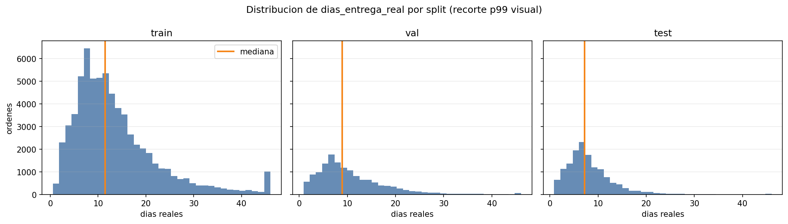
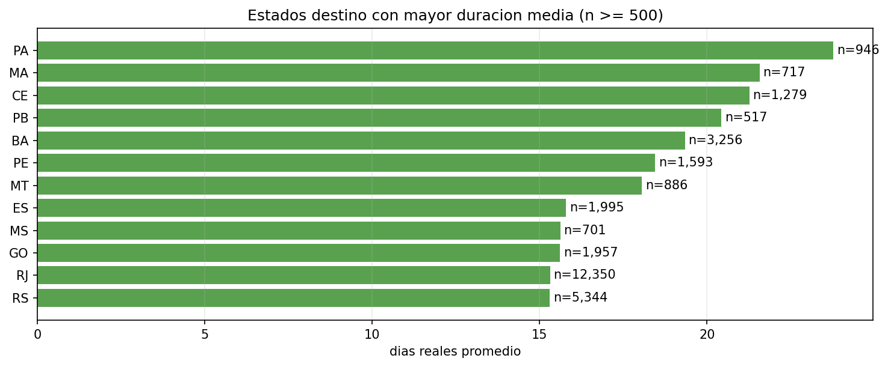
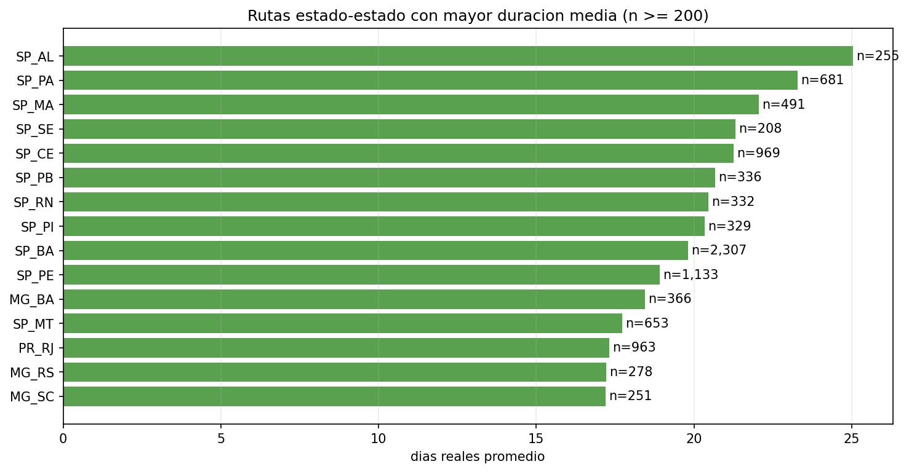
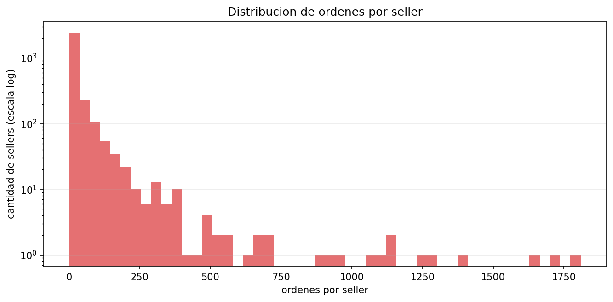
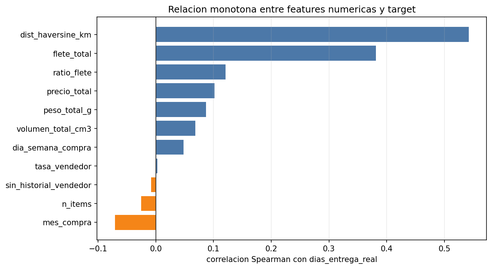

# Fase 2 - EDA de regresion sobre dias_entrega_real

> EDA significa analisis exploratorio de datos: revisar patrones antes de modelar. Este reporte interpreta el dataset experimental de Chat B para decidir que features deben avanzar a Chat D.

## 1. Resumen ejecutivo

El dataset contiene 96,470 ordenes y 21 columnas, con una mediana global de 10.22 dias reales de entrega y un p90 de 23.10 dias. La distribucion es asimetrica: la mayoria de ordenes se entrega relativamente rapido, pero hay una cola larga de casos lentos.

Las senales mas prometedoras son geograficas y operativas: estado destino (`customer_state`), ruta estado-estado (`ruta_estado` como soporte para rolling), estado vendedor, categoria, flete/precio/peso/volumen y la historia del seller cuando existe. La palabra rolling significa ventana movil de pasado: por ejemplo, mirar los ultimos 30 dias antes de la compra, sin incluir la orden actual.

Los riesgos principales son: cambio de regimen temporal R-14, cola larga de duraciones extremas, sellers con historial desigual y posible sobreinterpretacion de correlaciones. Correlacion significa que dos variables se mueven juntas; no demuestra que una cause la otra.

Features que parecen avanzar:

- `customer_state` y `seller_state`, por senal geografica interpretable.
- `ruta_estado` solo como soporte para rolling, no necesariamente como categoria cruda sin control.
- `categoria_principal`, con umbrales de volumen para evitar categorias raras.
- Variables fisicas y economicas: `flete_total`, `ratio_flete`, `peso_total_g`, `volumen_total_cm3`, `precio_total`, `n_items`.
- `tasa_vendedor` y `sin_historial_vendedor`, manteniendo calculo point-in-time.

## 2. Validacion del dataset de Chat B

### Shape y columnas

| revision | resultado |
| --- | --- |
| filas | 96,470 |
| columnas | 21 |
| order_id_unico | True |
| target_positivo | True |
| target_max_menor_365 | True |
| columnas_prohibidas_presentes_sin_target | ninguna |
| dias_prometidos_ausente | True |
| columnas_esperadas_presentes | True |

Columnas observadas:

```text
order_id, order_purchase_timestamp, split, dias_entrega_real, customer_state, seller_state, categoria_principal, mismo_estado, dist_haversine_km, precio_total, flete_total, ratio_flete, n_items, peso_total_g, volumen_total_cm3, mes_compra, dia_semana_compra, tasa_vendedor, sin_historial_vendedor, seller_id, ruta_estado
```

Cardinalidad de columnas categoricas y de soporte:

| columna | valores_unicos |
| --- | --- |
| customer_state | 27 |
| seller_state | 22 |
| ruta_estado | 409 |
| categoria_principal | 74 |
| seller_id | 2,960 |

### Conteo por split

| split | ordenes | share_pct |
| --- | --- | --- |
| train | 67,529 | 70.00 |
| val | 14,470 | 15.00 |
| test | 14,471 | 15.00 |

Rangos temporales por split:

| split | inicio | fin |
| --- | --- | --- |
| train | 2016-09-15 | 2018-04-15 |
| val | 2018-04-15 | 2018-06-21 |
| test | 2018-06-21 | 2018-08-29 |

### Distribucion de dias_entrega_real

| metrica | valor |
| --- | --- |
| count | 96,470.00 |
| mean | 12.56 |
| std | 9.55 |
| min | 0.53 |
| 5% | 3.02 |
| 10% | 4.16 |
| 25% | 6.77 |
| 50% | 10.22 |
| 75% | 15.72 |
| 90% | 23.10 |
| 95% | 29.27 |
| 99% | 46.05 |
| max | 209.63 |



### Revision anti-leakage rapida

Leakage significa fuga de informacion: usar datos del futuro como si fueran conocidos al momento de compra. En la salida revisada no aparecen `order_delivered_customer_date`, `order_delivered_carrier_date`, reviews, `entrega_tarde`, `dias_vs_promesa` ni `dias_prometidos`. `dias_entrega_real` esta presente solo como target, no como feature.

Porcentaje de nulos principales:

| columna | missing_pct |
| --- | --- |
| dist_haversine_km | 0.493 |
| order_purchase_timestamp | 0.000 |
| split | 0.000 |
| dias_entrega_real | 0.000 |
| order_id | 0.000 |
| customer_state | 0.000 |
| seller_state | 0.000 |
| categoria_principal | 0.000 |
| mismo_estado | 0.000 |
| precio_total | 0.000 |

## 3. Analisis temporal

| split | ordenes | media | mediana | p75 | p90 | p95 |
| --- | --- | --- | --- | --- | --- | --- |
| train | 67,529 | 13.82 | 11.48 | 17.19 | 25.09 | 32.00 |
| val | 14,470 | 10.84 | 8.91 | 14.03 | 20.21 | 24.85 |
| test | 14,471 | 8.37 | 7.23 | 10.27 | 14.26 | 17.95 |

La mediana baja de 11.48 dias en train a 7.23 dias en test. Esto es consistente con R-14: el regimen temporal de 2018 parece mas rapido que el pasado de entrenamiento. Si Chat D construye rolling features, debe reportar cobertura y efecto por split, porque una senal que funciona en train puede degradarse o cambiar de sentido en periodos recientes.

Lectura practica: el split temporal es correcto y necesario. No conviene usar split aleatorio, porque mezclaria meses viejos y nuevos y podria esconder el cambio de regimen.

## 4. Analisis por geografia

### Customer state

| customer_state | ordenes | media | mediana | p90 |
| --- | --- | --- | --- | --- |
| PA | 946 | 23.77 | 21.08 | 39.23 |
| MA | 717 | 21.57 | 19.19 | 34.32 |
| CE | 1,279 | 21.27 | 18.21 | 34.72 |
| PB | 517 | 20.43 | 18.15 | 34.95 |
| BA | 3,256 | 19.34 | 16.91 | 31.81 |



### Seller state

| seller_state | ordenes | media | mediana | p90 |
| --- | --- | --- | --- | --- |
| BA | 549 | 13.90 | 11.77 | 21.83 |
| SC | 3,551 | 13.76 | 11.75 | 23.09 |
| PR | 7,429 | 13.44 | 11.22 | 23.16 |
| MG | 7,647 | 12.88 | 10.79 | 22.29 |
| DF | 803 | 12.46 | 10.49 | 21.00 |
| SP | 68,415 | 12.36 | 10.00 | 23.24 |
| RJ | 4,185 | 12.10 | 9.97 | 22.18 |
| RS | 1,949 | 11.53 | 9.59 | 20.18 |

### Ruta estado-estado

| ruta_estado | ordenes | media | mediana | p90 |
| --- | --- | --- | --- | --- |
| SP_AL | 255 | 25.05 | 22.97 | 41.04 |
| SP_PA | 681 | 23.28 | 20.89 | 40.27 |
| SP_MA | 491 | 22.07 | 19.57 | 35.02 |
| SP_SE | 208 | 21.32 | 17.83 | 36.21 |
| SP_CE | 969 | 21.26 | 18.36 | 33.89 |



`ruta_estado` es especialmente util como base de features rolling: resume origen y destino sin usar datos futuros. Sin embargo, como categoria cruda puede generar alta cardinalidad y rutas con poco volumen. La recomendacion es usarla con umbral de cobertura y fallback por `customer_state`.

## 5. Analisis por seller

| metrica | valor |
| --- | --- |
| sellers_unicos | 2,960.00 |
| ordenes_por_seller_mediana | 7.00 |
| ordenes_por_seller_p75 | 22.00 |
| ordenes_por_seller_p90 | 72.00 |
| ordenes_por_seller_max | 1,809.00 |
| sellers_con_1_orden_pct | 18.18 |
| sellers_con_menos_5_ordenes_pct | 40.68 |
| ordenes_en_sellers_menos_5_ordenes_pct | 2.47 |
| ordenes_sin_historial_vendedor_pct | 15.10 |

| split | ordenes | sin_historial_pct | tasa_vendedor_media | tasa_vendedor_mediana |
| --- | --- | --- | --- | --- |
| train | 67,529 | 15.97 | 0.05 | 0.04 |
| val | 14,470 | 12.36 | 0.09 | 0.09 |
| test | 14,471 | 13.77 | 0.08 | 0.08 |



Hay 2,960 sellers. La cobertura historica no es uniforme: 15.10% de las ordenes queda marcada con `sin_historial_vendedor=1`. `tasa_vendedor` es valida solo porque fue calculada point-in-time, es decir, mirando pedidos previos ya cerrados antes de la compra actual.

`seller_id` crudo no debe ser feature inicial: puede memorizar vendedores del pasado, no generaliza bien a sellers nuevos o con pocas ordenes y complica la interpretacion. Si se usa seller, conviene convertirlo en agregados historicos con fallback: tasa/duracion rolling, conteo de historial y flag de insuficiencia.

## 6. Categoria y caracteristicas fisicas

Categorias con mayor duracion media y volumen suficiente:

| categoria_principal | ordenes | media | mediana | p90 |
| --- | --- | --- | --- | --- |
| office_furniture | 1,246 | 20.70 | 18.90 | 33.43 |
| consoles_games | 1,014 | 13.78 | 11.29 | 24.75 |
| garden_tools | 3,414 | 13.68 | 11.75 | 23.57 |
| computers_accessories | 6,500 | 13.19 | 11.11 | 23.45 |
| musical_instruments | 607 | 13.11 | 10.45 | 25.02 |
| furniture_decor | 6,213 | 13.11 | 10.89 | 23.29 |
| bed_bath_table | 9,167 | 13.03 | 10.77 | 23.37 |
| telephony | 4,076 | 12.97 | 10.81 | 23.84 |
| electronics | 2,507 | 12.94 | 11.01 | 23.81 |
| watches_gifts | 5,470 | 12.82 | 10.36 | 24.32 |
| stationery | 2,247 | 12.81 | 10.21 | 23.84 |
| desconocido | 1,359 | 12.76 | 10.76 | 23.38 |

Relacion de features numericas con el target:

| feature | pearson | spearman | missing_pct |
| --- | --- | --- | --- |
| dist_haversine_km | 0.39 | 0.54 | 0.49 |
| flete_total | 0.17 | 0.38 | 0.00 |
| ratio_flete | 0.08 | 0.12 | 0.00 |
| precio_total | 0.06 | 0.10 | 0.00 |
| peso_total_g | 0.07 | 0.09 | 0.00 |
| mes_compra | -0.05 | -0.07 | 0.00 |
| volumen_total_cm3 | 0.06 | 0.07 | 0.00 |
| dia_semana_compra | 0.03 | 0.05 | 0.00 |
| n_items | -0.02 | -0.03 | 0.00 |
| sin_historial_vendedor | -0.00 | -0.01 | 0.00 |
| tasa_vendedor | 0.02 | 0.00 | 0.00 |



Spearman mide relacion monotona por ranking: si una variable sube y el target tiende a subir tambien, Spearman sera positivo aunque la relacion no sea lineal. Las correlaciones son moderadas o bajas; eso no descarta utilidad en modelos tabulares, pero obliga a validar mejora incremental con MAE en Chat E.

## 7. Analisis profundo de feature engineering

Feature engineering significa disenar variables utiles para el modelo a partir de datos disponibles. En esta fase no buscamos agregar columnas por intuicion: buscamos decidir que senales tienen evidencia, cobertura, estabilidad temporal y bajo riesgo de leakage.

### 7.1 Punto de partida: features iniciales y preguntas a evaluar

La siguiente tabla separa las features base M0 de las columnas de soporte. M0 significa momento de compra: solo se aceptan variables conocidas en ese momento o historicos cerrados antes de ese momento.

| bloque | feature | rol | influencia_esperada | evaluar |
| --- | --- | --- | --- | --- |
| Geografia destino | customer_state | feature base M0 | El DVA/EDA previo mostro dolor regional fuerte; estados norte/nordeste tienden a entregas mas largas. | Mediana, p90, estabilidad por split y si rolling 30d por destino supera al estado crudo. |
| Geografia origen | seller_state | feature base M0 | El origen logistico puede afectar rutas, red de despacho y distancia efectiva. | Senal incremental frente a customer_state y estabilidad de combinaciones origen-destino. |
| Ruta | ruta_estado | soporte para analisis/rolling | Resume origen + destino; deberia capturar dificultad logistica mejor que un solo estado. | Volumen por ruta, rutas raras, cobertura en val/test y fallback por customer_state. |
| Cercania | mismo_estado | feature base M0 | Ordenes dentro del mismo estado deberian tender a menor duracion. | Diferencia real contra no mismo estado y aporte frente a distancia/ruta. |
| Distancia | dist_haversine_km | feature base M0 | Aproxima separacion cliente-vendedor; en EDA actual muestra relacion monotona fuerte. | No linealidad, bins de distancia, nulos y comparacion con ruta/estado. |
| Categoria | categoria_principal | feature base M0 | Algunas categorias tienen productos mas grandes, sellers distintos o logistica mas lenta. | Volumen por categoria, categorias raras, rolling por categoria e interaccion con ruta. |
| Economia | precio_total | feature base M0 | Puede actuar como proxy de tipo de producto o complejidad, no como causa directa. | Relacion no lineal, outliers y si solo replica categoria. |
| Envio | flete_total | feature base M0 | Puede resumir distancia, peso, volumen y politica comercial de envio. | Separar efecto de distancia/peso y comparar contra ratio_flete. |
| Envio | ratio_flete | feature base M0 | Flete alto relativo al precio puede indicar dificultad logistica. | Outliers, transformacion log/binning y estabilidad por split. |
| Complejidad orden | n_items | feature base M0 | Mas items podria implicar preparacion o consolidacion mas compleja. | Umbrales 1 vs multiples y si la relacion es debil/no lineal. |
| Fisica | peso_total_g | feature base M0 | Paquetes pesados pueden limitar opciones logisticas. | log_peso, bins, outliers e interaccion con distancia. |
| Fisica | volumen_total_cm3 | feature base M0 | Paquetes voluminosos pueden tener tratamiento logistico distinto. | log_volumen, bins, outliers e interaccion peso-volumen. |
| Temporal | mes_compra | feature base M0 | El DVA/EDA detecto cambio de regimen y estacionalidad. | Distinguir estacionalidad real de drift temporal; revisar por split. |
| Temporal | dia_semana_compra | feature base M0 | Puede afectar aprobacion/despacho indirectamente. | Confirmar si aporta o queda como senal secundaria. |
| Seller historico | tasa_vendedor | feature base M0 historica | En Fase 1 fue util y auditada point-in-time para tardanza. | Si tasa de tardanza predice duracion real o si conviene duracion rolling. |
| Seller historico | sin_historial_vendedor | feature base M0 historica | Marca incertidumbre para sellers nuevos o sin pasado suficiente. | Cobertura por split y diferencia de duracion/error con vs sin historial. |
| Seller soporte | seller_id | soporte para analisis/rolling | Puede contener senal, pero crudo tiende a memorizar y generaliza mal. | No usar crudo; evaluar agregados historicos con conteo y fallback. |

### 7.2 Marco de decision

Una feature candidata debe pasar cinco filtros antes de avanzar a Chat D:

- Disponibilidad M0: se conoce en la compra o se calcula con pasado cerrado.
- Cobertura: aplica a suficientes ordenes en train, val y test.
- Estabilidad: mantiene sentido entre periodos, especialmente por R-14.
- Interpretabilidad: se puede explicar al negocio sin forzar causalidad.
- Mejora incremental: en Chat E debe mejorar MAE o error regional frente a baselines.

MAE significa error absoluto medio: cuantos dias se equivoca una regla o modelo en promedio. En esta seccion todavia no entrenamos modelos; usamos baselines simples para medir senal inicial.

### 7.3 Baselines por agregacion historica

Estas reglas usan solo el split train para calcular medianas historicas y las aplican en val/test con fallback a la mediana global de train. Si una agregacion simple reduce MAE, la columna tiene senal candidata para feature engineering. Fallback significa valor de respaldo cuando una ruta, categoria o seller no tiene historial suficiente.

| split | regla | min_train_n | grupos_train | grupos_elegibles | cobertura_seen_pct | cobertura_elegible_pct | mae_fallback_global |
| --- | --- | --- | --- | --- | --- | --- | --- |
| test | ruta_estado | 20 | 381 | 127 | 99.81 | 97.17 | 4.47 |
| test | customer_state | 20 | 27 | 27 | 100.00 | 100.00 | 4.60 |
| test | categoria_principal | 20 | 73 | 63 | 99.92 | 99.54 | 5.02 |
| test | seller_state | 20 | 22 | 16 | 100.00 | 99.91 | 5.07 |
| test | global_train | 0 | 1 | 1 | 100.00 | 100.00 | 5.09 |
| test | seller_id | 5 | 2,178 | 1,267 | 74.82 | 69.49 | 5.11 |
| val | ruta_estado | 20 | 381 | 127 | 99.84 | 97.51 | 4.58 |
| val | customer_state | 20 | 27 | 27 | 100.00 | 100.00 | 4.70 |
| val | categoria_principal | 20 | 73 | 63 | 99.99 | 99.77 | 5.63 |
| val | seller_state | 20 | 22 | 16 | 100.00 | 99.96 | 5.65 |
| val | seller_id | 5 | 2,178 | 1,267 | 90.33 | 83.67 | 5.66 |
| val | global_train | 0 | 1 | 1 | 100.00 | 100.00 | 5.69 |

Lectura: `customer_state` y `ruta_estado` tienen una prueba inicial fuerte porque reglas muy simples por destino/ruta compiten contra la mediana global. `seller_id` puede mejorar en algunos casos, pero su cobertura elegible y su riesgo de memorizar vendedores obligan a no usarlo crudo.

### 7.4 Estabilidad temporal de agregaciones

La siguiente tabla compara medias de grupos entre train y val/test usando umbrales minimos de volumen. Una correlacion alta indica que el ranking de grupos se parece entre periodos; un shift alto indica que el nivel de dias cambio, aunque el orden relativo pueda mantenerse.

| feature | split_comparado | min_ordenes_por_split | grupos_comparables | corr_media_train_vs_split | shift_mediana_abs_dias |
| --- | --- | --- | --- | --- | --- |
| customer_state | val | 100 | 15 | 0.96 | 2.15 |
| customer_state | test | 100 | 14 | 0.96 | 5.10 |
| seller_state | val | 100 | 8 | 0.72 | 2.45 |
| seller_state | test | 100 | 8 | 0.33 | 4.08 |
| ruta_estado | val | 50 | 33 | 0.95 | 2.24 |
| ruta_estado | test | 50 | 36 | 0.92 | 4.95 |
| categoria_principal | val | 100 | 24 | 0.87 | 2.58 |
| categoria_principal | test | 100 | 25 | 0.84 | 4.11 |
| seller_id | val | 20 | 123 | 0.56 | 2.79 |
| seller_id | test | 20 | 98 | 0.63 | 3.90 |

Por R-14, no basta con encontrar diferencias entre grupos: hay que verificar si esas diferencias sobreviven al cambio temporal de 2018. Si una feature es estable en ranking pero baja de nivel, Chat D debe usar rolling reciente para capturar el nuevo regimen.

### 7.5 Features binarias: lectura operacional

| feature | valor | ordenes | share_pct | media | mediana | p90 |
| --- | --- | --- | --- | --- | --- | --- |
| mismo_estado | 0 | 61,769 | 64.03 | 15.15 | 12.79 | 26.28 |
| mismo_estado | 1 | 34,701 | 35.97 | 7.95 | 6.55 | 14.25 |
| sin_historial_vendedor | 0 | 81,906 | 84.90 | 12.57 | 10.25 | 23.16 |
| sin_historial_vendedor | 1 | 14,564 | 15.10 | 12.52 | 10.08 | 22.53 |

`mismo_estado` ayuda a resumir cercania logistica, pero probablemente queda por debajo de `ruta_estado` y `dist_haversine_km`. `sin_historial_vendedor` no busca explicar duracion por si sola; su valor es avisar que la historia del seller tiene baja confianza.

### 7.6 Transformaciones numericas candidatas

Muchas variables fisicas y economicas tienen cola larga: pocos pedidos muy pesados, muy caros o muy voluminosos. Una transformacion log1p comprime esos extremos. log1p significa aplicar log(1 + valor), util cuando hay ceros.

| feature_original | feature_candidata | transformacion | spearman_original | spearman_transformada | missing_pct |
| --- | --- | --- | --- | --- | --- |
| dist_haversine_km | log_dist_haversine_km | log1p | 0.543 | 0.543 | 0.493 |
| precio_total | log_precio_total | log1p | 0.102 | 0.102 | 0.000 |
| flete_total | log_flete_total | log1p | 0.382 | 0.382 | 0.000 |
| ratio_flete | log_ratio_flete | log1p | 0.121 | 0.121 | 0.000 |
| peso_total_g | log_peso_total_g | log1p | 0.087 | 0.087 | 0.000 |
| volumen_total_cm3 | log_volumen_total_cm3 | log1p | 0.069 | 0.069 | 0.000 |

La correlacion Spearman no cambia mucho con log1p porque Spearman usa ranking, pero la transformacion puede ayudar a modelos lineales y a controlar outliers. Para arboles como XGBoost puede ser menos necesaria, aunque sigue siendo util para interpretacion y baselines lineales.

### 7.6.1 Multicolinealidad exploratoria

Multicolinealidad significa que dos o mas features cuentan informacion muy parecida. En Chat C se revisa como alerta de diseno: no elimina variables de forma definitiva, pero advierte que Chat E debe medir si una variable aporta algo nuevo o solo repite informacion de otra.

Matriz Spearman entre features numericas y binarias relacionadas con distancia, costo y fisica del envio:

| feature | dist_haversine_km | flete_total | ratio_flete | precio_total | peso_total_g | volumen_total_cm3 | mismo_estado | n_items |
| --- | --- | --- | --- | --- | --- | --- | --- | --- |
| dist_haversine_km | 1.000 | 0.584 | 0.218 | 0.111 | 0.026 | 0.014 | -0.760 | -0.013 |
| flete_total | 0.584 | 1.000 | 0.103 | 0.470 | 0.492 | 0.425 | -0.555 | 0.378 |
| ratio_flete | 0.218 | 0.103 | 1.000 | -0.785 | -0.257 | -0.168 | -0.202 | 0.084 |
| precio_total | 0.111 | 0.470 | -0.785 | 1.000 | 0.535 | 0.418 | -0.102 | 0.178 |
| peso_total_g | 0.026 | 0.492 | -0.257 | 0.535 | 1.000 | 0.781 | -0.023 | 0.185 |
| volumen_total_cm3 | 0.014 | 0.425 | -0.168 | 0.418 | 0.781 | 1.000 | -0.012 | 0.198 |
| mismo_estado | -0.760 | -0.555 | -0.202 | -0.102 | -0.023 | -0.012 | 1.000 | 0.009 |
| n_items | -0.013 | 0.378 | 0.084 | 0.178 | 0.185 | 0.198 | 0.009 | 1.000 |

Pares con mayor redundancia exploratoria:

| feature_a | feature_b | spearman | spearman_abs | lectura |
| --- | --- | --- | --- | --- |
| ratio_flete | precio_total | -0.785 | 0.785 | alta redundancia exploratoria |
| peso_total_g | volumen_total_cm3 | 0.781 | 0.781 | alta redundancia exploratoria |
| dist_haversine_km | mismo_estado | -0.760 | 0.760 | alta redundancia exploratoria |
| dist_haversine_km | flete_total | 0.584 | 0.584 | redundancia moderada |
| flete_total | mismo_estado | -0.555 | 0.555 | redundancia moderada |
| precio_total | peso_total_g | 0.535 | 0.535 | redundancia moderada |
| flete_total | peso_total_g | 0.492 | 0.492 | redundancia moderada |
| flete_total | precio_total | 0.470 | 0.470 | redundancia moderada |
| flete_total | volumen_total_cm3 | 0.425 | 0.425 | redundancia moderada |
| precio_total | volumen_total_cm3 | 0.418 | 0.418 | redundancia moderada |
| flete_total | n_items | 0.378 | 0.378 | baja redundancia |
| ratio_flete | peso_total_g | -0.257 | 0.257 | baja redundancia |

Implicacion: `dist_haversine_km`, `flete_total`, `ratio_flete`, peso y volumen pueden solaparse parcialmente porque todos describen dificultad logistica. Para modelos lineales, Chat E debe revisar VIF o regularizacion. Para modelos de arboles, el riesgo principal es interpretar mal las importancias, porque dos features redundantes pueden repartirse el mismo merito predictivo.

### 7.7 Hipotesis por bloque

Geografia y ruta:

- Hipotesis: la dificultad de entrega depende mas del destino y la ruta que de una distancia lineal pura.
- Evidencia actual: `dist_haversine_km` tiene Spearman alto y los estados/rutas lentas se concentran en destinos especificos.
- Evaluacion Chat D: rolling 30d por `ruta_estado` y `customer_state`, con conteo y fallback.

Seller:

- Hipotesis: sellers con historial reciente lento tienden a generar entregas mas largas, pero solo cuando hay historial suficiente.
- Evidencia actual: muchos sellers tienen bajo volumen; `tasa_vendedor` tiene baja correlacion directa con duracion real.
- Evaluacion Chat D: reemplazar o complementar con `seller_id_30d_days_mean`, conteo previo y flag de insuficiencia.

Categoria y fisica:

- Hipotesis: categorias, peso, volumen y flete capturan complejidad logistica, aunque no necesariamente causalidad.
- Evidencia actual: categorias como `office_furniture` muestran mayor duracion; flete y distancia tienen relacion monotona.
- Evaluacion Chat D/E: rolling por categoria y transformaciones log/bins para fisicas.

Temporalidad:

- Hipotesis: el regimen logistico cambia en 2018; las medias historicas largas pueden quedar desactualizadas.
- Evidencia actual: la mediana baja de train a test de forma marcada.
- Evaluacion Chat D: rolling 30d primero; comparar 60/90d si 30d tiene poca cobertura.

### 7.8 Transformaciones e interacciones candidatas

Transformaciones que deben evaluarse:

- `log_dist_haversine_km`, `log_flete_total`, `log_peso_total_g`, `log_volumen_total_cm3`.
- Bins de distancia: corta, media, larga, muy larga, definidos por cuantiles de train.
- Flags de paquete pesado/voluminoso usando p90 de train.
- Conteos historicos por grupo para que el modelo sepa que tan confiable es cada agregado.

Interacciones candidatas con cautela:

- `ruta_estado` x `categoria_principal`, solo si hay volumen suficiente.
- `dist_haversine_km` x `peso_total_g` o bins de distancia x peso alto.
- `customer_state` x `mes_compra`, para capturar estacionalidad regional.
- Seller historico x categoria, solo como experimento posterior si hay cobertura.

### 7.9 Matriz de decision

| feature | senal | evidencia | riesgo | decision |
| --- | --- | --- | --- | --- |
| customer_state | alta | baseline mediana estado MAE val 4.70; estabilidad corr 0.96 | bajo | avanza y rolling 30d prioritario |
| seller_state | media | baseline MAE val 5.65 | bajo/medio | mantener base; evaluar interaccion con destino |
| ruta_estado | alta | baseline ruta MAE val 4.58; cobertura elegible val 97.5% | medio por cardinalidad | avanza como rolling con fallback |
| dist_haversine_km | alta descriptiva | Spearman 0.54 | nulos bajos y no linealidad | mantener; evaluar bins/log |
| categoria_principal | media | baseline categoria MAE val 5.63; estabilidad corr 0.87 | categorias raras | avanza con conteos y fallback |
| flete_total / ratio_flete | media | Spearman flete 0.38; ratio 0.12 | proxy de otras variables | mantener; transformar/log y controlar outliers |
| peso_total_g / volumen_total_cm3 | baja/media | Spearman peso 0.09; volumen 0.07 | colas largas | mantener con log/bins; validar incremental |
| mes_compra / dia_semana_compra | baja directa | Spearman mes -0.07; dia 0.05 | capturar drift temporal | mantener como control; no sobreinterpretar |
| tasa_vendedor | incierta para duracion | Spearman 0.00 | debe seguir point-in-time | reemplazar/complementar con duracion rolling seller |
| seller_id | potencial pero riesgosa | baseline seller MAE val 5.66; cobertura elegible val 83.7% | memoriza y no generaliza a sellers nuevos | no usar crudo; solo agregados historicos |

### 7.9.1 Como se traduce esta matriz hacia Chat D

La matriz no es una seleccion final de features del modelo. Es una decision de diseno para el siguiente paso: que familias vale la pena construir como features candidatas, cuales necesitan controles y cuales no deben usarse como feature directa.

Lectura operativa:

- `avanza`: Chat D debe construir una version point-in-time, medir cobertura y documentar fallback.
- `mantener base`: la feature puede seguir en el dataset base, pero no requiere rolling inmediata.
- `cautela`: la feature puede ser util, pero necesita controles de volumen, multicolinealidad o leakage.
- `no usar crudo`: la columna puede servir como soporte para agregados, pero no como entrada directa del modelo.

La seleccion real queda para Chat E: comparar modelos con y sin cada bloque mediante MAE, MedAE, p90 del error y revision regional. Por eso Chat D debe entregar features candidatas bien calculadas, no una lista cerrada de features finales.

### 7.10 Deben avanzar

- Rolling 30 dias de `ruta_estado` para media/mediana de `dias_entrega_real`, con conteo de observaciones.
- Rolling 30 dias de `customer_state`, por alta cobertura esperada y lectura simple de destino.
- Rolling 30 dias de `categoria_principal`, con categorias raras respaldadas por promedio global o grupo `desconocido`.
- Rolling de seller solo si incluye conteo previo, flag de historial insuficiente y fallback por ruta/estado.
- Mantener features base M0 fisicas, economicas y temporales para comparar contra el baseline sin rolling.

### 7.11 Requieren cautela

- `tasa_vendedor`: util, pero debe seguir siendo point-in-time y auditable.
- `ruta_estado` cruda: prometedora, pero con riesgo de alta cardinalidad y rutas raras.
- `dist_haversine_km`: interpretable, aunque tiene algunos nulos y puede capturar peor que estado/ruta la realidad logistica.
- `dias_prometidos`: no debe entrar al modelo principal; solo benchmark controlado para medir si el modelo copia la politica actual.

### 7.12 No deben avanzar

- `dias_entrega_real` como feature: es el target.
- Fechas posteriores a la compra: `order_delivered_customer_date` y `order_delivered_carrier_date`.
- `dias_vs_promesa`, `entrega_tarde` y variables de reviews.
- `seller_id` crudo en el primer modelo.
- Clustering como requisito MVP; clustering puede quedar como experimento futuro si los baselines dejan una pregunta clara.

## 8. Recomendacion para Chat D

A partir de las conclusiones 7.9 a 7.12, Chat D debe construir features candidatas, no seleccionar el modelo final. La prioridad es convertir las senales prometedoras en variables point-in-time auditables, con conteo de historial y fallback.

Construir primero estas rolling features point-in-time:

- `ruta_estado_30d_days_mean`, `ruta_estado_30d_days_median`, `ruta_estado_30d_orders_count`.
- `customer_state_30d_days_mean`, `customer_state_30d_days_median`, `customer_state_30d_orders_count`.
- `categoria_principal_30d_days_mean`, `categoria_principal_30d_orders_count`.
- `seller_id_30d_days_mean`, `seller_id_30d_orders_count`, `seller_id_30d_sin_historial`.

Ventanas sugeridas: empezar con 30 dias por ser el diseno aprobado; comparar contra 60 y 90 dias solo si 30 dias muestra baja cobertura o alta volatilidad. Para seller, evaluar tambien ventana acumulada historica con desplazamiento, porque muchos sellers pueden no tener suficiente volumen en 30 dias.

Criterios minimos de validacion:

- Excluir la orden actual y cualquier orden futura.
- Exigir conteo previo por grupo y reportar cobertura por split.
- Usar fallback jerarquico: ruta -> customer_state -> global train, y seller -> ruta/customer_state -> global train.
- Comparar cobertura y estabilidad en train, val y test.
- En Chat E, aceptar features solo si mejoran MAE o reducen errores regionales frente a baselines.
- Llevar a Chat E las alertas de multicolinealidad para evaluar redundancia con ablacion y, si aplica, VIF.

## 9. Limitaciones y dudas

- Este EDA no prueba causalidad; solo identifica senales predictivas candidatas.
- El dataset no mide conversion, abandono de carrito ni costo logistico real.
- La cola larga del target puede afectar MAE; conviene reportar tambien MedAE y p90 del error en modelado.
- R-14 sigue abierto: el futuro reciente es mas rapido que el pasado de train.
- Las figuras usan agregados descriptivos; no reemplazan validacion con modelo y backtesting.

## 10. Figuras generadas

- `target_distribution`: `reports/figures_fase2_eda/target_distribution_by_split.png`
- `customer_state`: `reports/figures_fase2_eda/customer_state_top_duration.png`
- `ruta_estado`: `reports/figures_fase2_eda/ruta_estado_top_duration.png`
- `seller_distribution`: `reports/figures_fase2_eda/seller_orders_distribution.png`
- `numeric_correlations`: `reports/figures_fase2_eda/numeric_spearman_correlations.png`

## 11. Comando reproducible

```powershell
venv\Scripts\python.exe scripts\eda_fase2_regresion.py
```
